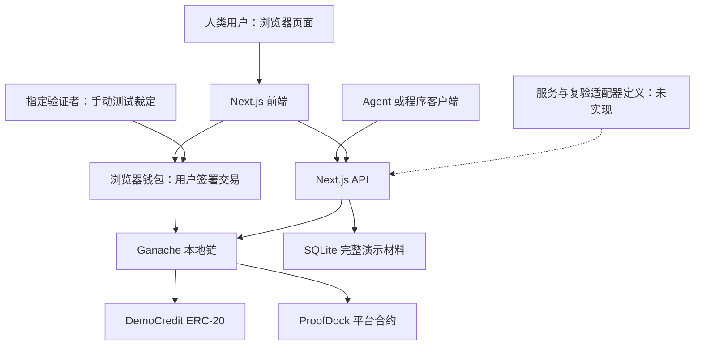

# ProofDock：当前技术栈与项目结构

文档日期：2026 年 10 月 7 日  
项目位置：`/Users/xiaogao/Desktop/Vscode/ProofDock`  
版本定位：本地最小演示原型（MVP）  
依据：当前源代码、已安装依赖、启动与部署脚本；以下区分实际实现与后续计划。

## 1. 项目用途与当前范围

ProofDock 是面向用户与 Agent 的服务履约记录平台，目标是把一次服务使用的证据变成可以查阅、质押担保和挑战的信息。平台不采集星级或主观好评。

当前版本已实现本地链和测试资金流程：发布演示记录并质押、链上付费查询、收入记账与领取、挑战、指定验证者手动测试裁定、质押退出和超时结束争议。

Remix 和 OneCompiler 是计划接入的 Solidity 服务提供方，目前仅有目录标识与接口定义，没有真实服务调用。独立自动复验也没有实现。当前材料由发布者签名，类型标识为 `publisher-demo`，不属于服务方签名或实际适配器执行见证。

### 当前完成状态

| 能力 | 当前状态 |
|---|---|
| 本地 EVM 链与 ERC-20 测试代币 | 已实现 |
| 浏览器钱包接入、网络配置、交易签署 | 已实现；用户钱包 UI 确认仍需在装有扩展的浏览器中体验 |
| 发布记录、质押、去重 | 已实现 |
| 链上查询付款、发布者分成、领取 | 已实现 |
| 挑战、手动测试裁定、资金处理 | 已实现 |
| 退出等待期、挑战超时退款 | 已实现 |
| 本地 SQLite 存证、付费详情 API | 已实现 |
| 服务执行、自动复验 | 未实现，接口返回 501 |
| ERC-8004 注册与对接 | 未实现 |
| 公共测试网、主网、生产安全审查 | 未实现 |

## 2. 当前实际技术栈

版本为本次核对的已安装版本；依赖声明范围见 package.json，解析版本由 pnpm-lock.yaml 锁定。

| 层次 | 技术与版本 | 用途 |
|---|---|---|
| 运行环境 | Node.js 24.19.0 | 网站、链、部署与测试脚本；内置 SQLite |
| 包管理 | pnpm，含锁文件 | 安装与锁定依赖 |
| 网站与后端 | Next.js 15.5.27，App Router | 页面、服务端 API、构建与本地运行 |
| 页面组件 | React / React DOM 19.3.0 | 页面状态、表单、钱包操作展示 |
| 页面样式 | 手写 CSS | 中文界面、布局和窄屏适配 |
| 链与钱包 SDK | ethers.js 6.17.0 | BrowserProvider、合约调用、签名恢复、摘要计算、部署 |
| 本地链 | Ganache 7.9.2 | Chain ID 31337 的本地 EVM 与开发账户 |
| 合约语言与编译器 | Solidity / solc-js 0.8.30 | 编译平台合约；部署配置采用 Shanghai EVM、优化 200 runs |
| 通用合约组件 | OpenZeppelin Contracts 5.6.1 | ERC20、SafeERC20、ReentrancyGuard |
| 数据库 | Node 内置 node:sqlite / SQLite | 保存完整 JSON 演示凭证 |
| 测试 | Node 脚本、node:assert、ethers.js | 链上资金与权限验证、HTTP API 验证 |
| 版本控制 | Git | 已初始化本地仓库，未连接远程仓库 |

当前页面与 API 源码是 JavaScript（`.js`），脚本是 ESM（`.mjs`）；适配器定义采用 TypeScript（`.ts`）。项目不是完整 TypeScript 工程。

### 与前期方案的差异

为尽快完成最小演示，目前没有使用 Tailwind CSS、wagmi、viem、Fastify、Foundry 或 Anvil。对应功能分别由手写 CSS、ethers.js、Next.js Route Handler、solc-js 和 Ganache 提供。没有 PostgreSQL、S3 对象存储、常驻事件索引服务或独立任务队列。

这些是后续可选择的迁移方向，不应列为当前已使用的技术。

## 3. 架构与职责



- 前端负责展示、钱包交互、材料签名和交易发起。
- API 负责材料保存、签名检查、链上状态读取与付款关联验证。
- 合约负责资金托管、记录状态、收入记账和裁定权限。
- SQLite 保存完整材料；资金及质押状态以合约为准。
- 当前 API 请求按需读取合约，不维护独立事件索引器。
- 真实服务和复验执行器尚未接入；手动裁定用于演示合约状态机。

## 4. 项目目录

```text
ProofDock/
├── package.json                  依赖与开发命令
├── pnpm-lock.yaml                实际依赖版本锁文件
├── pnpm-workspace.yaml           可选原生加速扩展的安装配置
├── .gitignore                    排除依赖、构建产物、运行数据与日志
├── README.md                     运行、钱包与演示说明
├── 启动.command                  启动链、部署、启动网站并打开页面
├── 停止.command                  停止本项目记录的进程
├── contracts/
│   └── ProofDock.sol             DemoCredit 和 ProofDock 两个合约
├── adapters/
│   └── index.ts                  服务执行与复验接口定义
├── scripts/
│   ├── runtime.sh                定位 Node 和项目路径
│   ├── chain.mjs                 启动 Ganache
│   └── deploy.mjs                编译、部署、分发测试代币
├── web/
│   ├── app/
│   │   ├── layout.js             HTML 框架与元数据
│   │   ├── page.js               当前单页网站与四个功能标签
│   │   ├── style.css             页面样式
│   │   └── api/
│   │       └── route.js          统一 HTTP API 入口
│   ├── public/
│   │   └── deployment.json       运行时生成的合约地址、ABI、公开账户
│   └── .next/                    构建产物，不纳入版本控制
├── data/
│   ├── .gitkeep                  保留空目录
│   ├── deployment.json           后端使用的部署配置
│   └── proofdock.sqlite          运行时生成的本地数据库
├── tests/
│   ├── flow.mjs                  合约资金、权限与状态测试
│   └── api.mjs                   API 存证、付款和签名测试
├── docs/
│   └── 技术栈与项目结构.md         本文档
├── .logs/                        链与网站运行日志
└── .pids/                        本项目启动的进程编号
```

`deployment.json` 包含公开地址和 ABI，不包含私钥。当前完整 JSON 凭证直接存入 SQLite，不是保存到 S3 或单独文件对象存储。

## 5. 网站功能

网站地址：`http://127.0.0.1:4319`。

| 标签或区域 | 当前行为 |
|---|---|
| 顶部钱包区 | 添加本地网络、请求连接、显示地址；账户或网络改变后要求重新连接 |
| 余额区 | 显示测试 ETH、DCR、合约内可领取金额和记录数量 |
| 履约记录 | 展示两家待接入服务、记录摘要、状态、付款查询及挑战入口 |
| 发布与质押 | 生成演示材料，钱包签名，保存材料，授权代币并上链锁定质押 |
| 我的资产 | 领取可用资金，查看本人的记录，申请退出和完成退出 |
| 测试裁定 | 指定验证者手动提交支持记录、记录错误或无法验证 |

每次链上操作前估算 gas 并提示，由当前钱包确认。钱包未连接时不能发布。当前没有任意文件上传表单、完整后台、自动复验进度系统或钱包内置账户切换器。

## 6. 合约与经济参数

### 6.1 DemoCredit

- 名称：Demo Credit；符号：DCR；18 位小数。
- 部署时向部署者铸造 1,000,000 DCR。
- 部署脚本向账户 1–4 分别转入 1,000 DCR。
- 没有公开领币接口，也没有真实资产价值。

### 6.2 ProofDock

| 参数 | 演示值 |
|---|---:|
| 发布质押 STAKE | 10 DCR |
| 单记录查询费 FEE | 1 DCR |
| 挑战保证金 BOND | 5 DCR |
| 发布者查询分成 | 70% |
| 平台账户查询分成 | 30% |
| 退出等待 WAIT | 60 秒 |
| 挑战超时 | 300 秒 |

平台账户 treasury 是部署者；validator 为部署时指定的账户 3。当前参数是合约常量，没有管理界面调整。没有专门复验储备，也没有实现验证者报酬。

| 函数 | 功能 |
|---|---|
| publish(id, evidence) | 防重复登记，收取 10 DCR 并保存证据摘要 |
| query(id, queryId) | 收取 1 DCR，绑定买方与记录，给发布者及平台记账 |
| challenge(id, objection) | 收取 5 DCR，锁定记录争议状态；清除已有退出申请 |
| resolve(id, outcome, report) | 指定验证者裁定；处理资金和状态 |
| timeout(id) | 超时后任何人可触发“无法验证”，退回挑战本金 |
| requestExit(id) | 发布者申请退出，记录可退出时间 |
| exit(id) | 等待期结束且无未决争议后结束质押，本金转为可领取余额 |
| withdraw() | 当前账户领取全部 credits；不自动替别人支付转账 gas |

状态编号：0 未发布、1 有质押未复验、2 挑战中、3 测试裁定支持、4 记录错误、5 质押退出。

裁定结果：

- 支持记录：状态变为 3，挑战保证金 5 DCR 记给发布者，10 DCR 质押继续锁定。
- 记录错误：状态变为 4，挑战者获挑战本金 5 DCR 和发布质押 10 DCR。
- 无法验证：状态回到 1，挑战者取回 5 DCR，发布质押仍锁定。结果可从裁定事件查询，但当前列表不单独显示“无法验证”状态。

挑战中、错误和已退出的记录不能接受新查询。退出申请的等待期内仍可查询或挑战。成功挑战不追溯扣回已经记入发布者 credits 的历史查询收入。

查询、质押、保证金使用同一种 DCR；gas 使用测试 ETH。资金先在合约记账，再由接收方领取。时间经过不自动执行退出或超时操作，仍需有人提交交易。

## 7. API 与签名

API 根地址：`http://127.0.0.1:4319/api`。

| 方法与参数 | 用途 |
|---|---|
| GET /api | 返回链上已发布且证据与发布者匹配的记录摘要 |
| GET /api?action=services | 返回 Remix / OneCompiler 的接口预留状态 |
| POST /api | 检查发布者签名，保存演示材料，返回 id 和 evidence |
| GET /api?action=detail&… | 核对钱包签名、queryId 买方、关联记录和链上证据，返回完整材料 |
| GET /api?action=execute | 501，真实服务未实现 |
| GET /api?action=verify | 501，自动复验未实现 |

POST 请求包含 payload、address、signature。记录 id 是 taskId 的 keccak256；evidence 是 JSON.stringify(payload) 字节的 keccak256。相同 id、材料和签署者可幂等重试，冲突材料拒绝。

材料签名消息为 `ProofDock evidence:<evidenceHash>`。详情签名消息依次包含 `ProofDock detail`、记录 id 和查询 id，以换行连接。

当前采用普通钱包消息签名，不是 EIP-712 结构化签名；消息没有 chainId、合约地址、过期时间或会话 nonce。字段顺序影响 JSON 摘要，尚无规范化编码。跨部署重放防护与限时授权需要后续实现。

付款查询 id 只能登记一次；已付款的固定记录详情可以重复读取。当前不是每次 HTTP 读取都再次收费。钱包签名由客户端提供，API 不托管用户私钥。

## 8. 接口预留

`adapters/index.ts` 定义：

- ExecutionRequest：taskId、serviceId、version、input、settings。
- Receipt：taskId、inputHash、outputHash、version、signerType、signature。
- ServiceAdapter：getCapabilities、execute、getReceipt、health。
- VerificationAdapter：prepareVerification、verify、getReport。

上述是类型约定，不是已经实例化并被后端调用的适配器。Receipt 预留 provider / adapter 两种签名来源；当前演示数据库用 publisher-demo，二者尚未统一。正式接入时需扩展数据格式，补齐工具链、依赖、验收规则、付款凭证以及签名域。

## 9. 运行与测试

### 网络与进程

- RPC：`http://127.0.0.1:8545`；chainId：31337。
- 网站：`http://127.0.0.1:4319`。
- 两个服务仅监听本机地址。
- Ganache 使用 deterministic 开发账户，属于公开测试账户，不存放真实资金。
- 启动脚本优先定位当前机器的 Codex 内置 Node，找不到则使用 PATH 中的 Node。迁移到队友机器需 Node.js 24 和已安装依赖。

双击 `启动.command`：启动本地链、清理上一轮演示数据库、部署两个合约、分发 DCR、在缺少构建产物时构建网站、启动构建版网站并打开浏览器。保持启动终端打开。`停止.command` 根据项目记录的进程编号停止服务。

本地链不配置持久化数据库；再次启动会重置链与记录。若端口 8545 被其他进程占用，启动脚本拒绝继续，避免连接错误的链。

### 开发命令（在项目根目录）

```bash
pnpm install
pnpm dev
pnpm build
pnpm chain
pnpm deploy
pnpm test
node tests/api.mjs
```

开发服务器与构建版服务器不要同时使用同一份 `.next` 输出执行构建。修改页面后，先停止网站，重新 build，再启动。测试依赖运行中的链及部署文件；API 测试还依赖运行中的网站。

### 已有验证

- flow.mjs：质押、查询分成、重复发布与付款拒绝、裁定权限、挑战成功和失败、重复领取拒绝、退出等待期、挑战超时退款。
- api.mjs：材料签名、重复请求幂等、链上发布与公开摘要、付费详情、错误签名与无付款拒绝、未实现接口 501。
- Next.js 网站构建通过；浏览器检查了记录列表及发布页面。

测试会修改本地余额、记录和链时间。之前测试结果不代表完整钱包 UI 已验收，也不代表合约经过生产安全审计。

## 10. 当前信任边界与下一步

1. 单个指定验证者可以手动裁定；合约不证明裁定正确，没有独立自动重跑。
2. 材料由发布者签署，不能证明陌生第三方实际执行了任务。
3. 链外详情由本地后端交付，没有已付款但材料不可用时的自动退款机制。
4. 证据摘要可验证内容关联，不能证明事实真实；链上公开信息可绕过平台读取。
5. API 采用集中式存储和按需链上查询，未实现持续事件索引、限流和正式访问控制。
6. 后续依次完善统一凭证与签名域、真实服务接入、独立复验报告、查询交付退款、证据访问与保留、验证者报酬与分成规则、ERC-8004 对接及公共测试网部署。

本版本验证的是“钱包—合约—API—页面”的平台基础闭环，不是已上线的第三方编译信誉市场。
